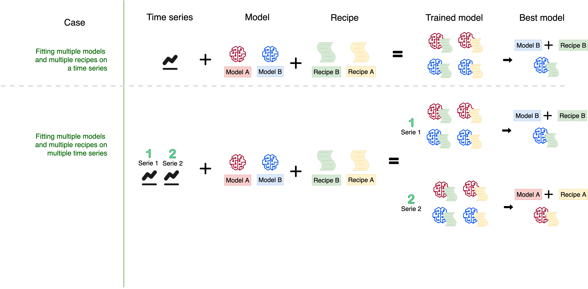

```{r setup, include=FALSE}
knitr::opts_chunk$set(
  echo = TRUE,
  warning = FALSE,
  message = FALSE,
  comment = "##",
  R.options = list(width = 60)
)

if(!require("modeltime")) install.packages("modeltime")
if(!require("rsample")) install.packages("rsample")
if(!require("parsnip")) install.packages("parsnip")
if(!require("recipes")) install.packages("recipes")
if(!require("workflows")) install.packages("workflows")
if(!require("dplyr")) install.packages("dplyr")
if(!require("tidyr")) install.packages("tidyr")
if(!require("sknifedatar")) install.packages("sknifedatar")
if(!require("earth")) install.packages("earth")
if(!require("glmnet")) install.packages("glmnet")
if(!require("DBI")) install.packages("DBI")
if(!require("kableExtra")) install.packages("kableExtra")
if(!require("gt")) install.packages("gt")
if(!require("DT")) install.packages("DT")
if(!require("webshot")) install.packages("webshot")

#Activa el package
library(modeltime)
library(rsample)
library(parsnip)
library(recipes)
library(workflows)
library(dplyr)
library(tidyr)
library(sknifedatar)
library(DBI)
library(kableExtra)
library(gt)
library(DT)
library(googlesheets4)
library(googledrive)
library(lubridate)
library(webshot)
```

```{r echo=FALSE}
source("Modulos/plot_time_series.R")

```


## Introducción

El objetivo de esta etapa es evaluar distintos modelos de series de tiempo y seleccionar el que mejor se ajusta a nuestros datos. 
Por la naturaleza del negocio de __GeoPagos__, cada partner representa una serie de tiempo pero también lo representa cada uno de los outputs que queremos proyectar, es decir _transacciones_ y _usuarios transaccionales_.
En este documeto se evaluan distintos modelos para las __transacciones__

## Workflow

Tal como se menciona en el párrafo anterior, el modelo de negocio de __GeoPagos__ nos demanda poder implementar un flujo de trabajo capaz de poder evaluar distintos __modelos__ para cada una de las __series de tiempo__ (combinación de partner y output).


<!-- # ```{r workflow,out.width = "75%", fig.align = "center", echo=FALSE, fig.cap = 'Workflow evaluación de múltiples modelos en múltiples series de tiempo.', fig.show = "hold"} -->
<!-- #  -->
<!-- #  -->
<!-- #  -->
<!-- # ``` -->


La Figura 1 muestra la integración de dos flujos de trabajos, por un lado la de múltiples series de tiempo y modelos y por otro lado el de entrenamiento de los modelos.

### Workflow modelado

Este workflow es implementado en el framework _Tidymodels_, y comprende en general las siguientes etapas y librerias:

<!-- # ```{r tidymodels,out.width = "75%", fig.align = "center", echo=FALSE, fig.cap = 'Workflow tidymodels', fig.show = "hold"} -->
<!-- # knitr::include_graphics("tidymodels.png") -->
<!-- #  -->
<!-- # ``` -->


El paquete __Modeltime__, representa una extensión del framework __Tidymodels__, de ahí que compartan casi todo el workflow, pero agrega al análisis de series temporales una serie de funciones que permiten la escalabilidad en la evaluación de múltiples modelos de series de tiempo.
Para ello, implementan un tipo de pronóstico que definen como [pronóstico anidado](https://business-science.github.io/modeltime/articles/nested-forecasting.html) y que implica _"convertir muchas series de tiempo en un conjunto de datos anidados y luego ajustar muchos modelos a cada uno de los datos anidados"_.
Haremos uso en esta ocasión del paquete __sknifedatar_ que nos permite vincular __modeltime__ con el conjunto de datos.
El workflow implica entonces:

1. Preprocesamiento de las series
2. Instanciación de los modelos
3. Entrenamiento de los modelos
4. Evaluación de los modelos
5. Selección del mejor modelo
6. Entrenamiento del mejor modelo
7. Proyección de datos
8. Guardamos las proyecciones y la tabla de precisión del mejor modelo

## Preprocesamiento

Esta etapa de la evaluación de los modelos de series de tiempo abarca aquéllas acciones de transformación de los datos para que sean adecuados para el modelado.
Aquí se hace uso del paquete __recipes()__ que nos permite organizar las transformaciones para el preprocesamiento de la información de forma tal que sea lo más reproducible posible.


```{r sqlserver, echo=FALSE}
con <- DBI::dbConnect(odbc::odbc(),
                      driver = "SQL Server",
                      server = "10.0.55.50",
                      database = "bi-test",
                      uid = "hernanh",
                      pwd = "Geopagos!123",
                      encoding= "UTF-8")
```

#### Traigo los historicos de Transacciones

```{sql, connection=con, output.var="tx_geopagos"}
select * from SCI_BUDGET_HISTORICOS_v2 
WHERE Tipo_historico IN('Tx');

```

#### Selecciono las variables de interés
Se exluyen aquéllos partners con menos de 3 observaciones en las series temporales. Además se cambia el nombre de la cantidad de Tx de _Valor_ a _value_ y de _Mes_ a _date_ para ajustarlo a las librerias.

```{r}
incluir <- tx_geopagos %>%
  group_by(Partner) %>%
  summarise(ocurrence= n_distinct(Mes)) %>%
  filter(ocurrence > 10) %>%
  select(Partner) %>%
  pull

tx_geopagos <- tx_geopagos %>%
  filter(Partner %in% incluir & Valor > 0) %>%
  select(Partner,Mes,Valor) %>%
  mutate(Mes= as.Date(Mes)) %>%
  rename(value= "Valor", date= "Mes")
```

#### Anido la serie de dato por partner

```{r}
tx_nested = tx_geopagos %>% nest(nested_column=-Partner)

tx_nested 
```

#### Armo las recetas


La receta 1, es la utilizada por los modelos de redes neuronales
```{r}

receta_tx_1 = recipe(value ~ ., data = tx_geopagos %>% select(-Partner)) %>%
  step_date(date, features = c("month", "quarter", "year"), ordinal = TRUE)
```

Esta receta es utilizada por el resto de los modelos. Una de las transformaciones que se hace en esta receta es la conversión de la variable de fecha a una variable de tipo numérica, compatible con los modelos lineales.

```{r}
receta_tx_2 = receta_tx_1 %>%
  step_mutate(date_num = as.numeric(date)) %>% 
  step_normalize(date_num) %>%
  step_rm(date) %>% 
  step_dummy(date_month)
```

El paquete __recipes()__ facilita la transformación y el procesado de los datos a través de las funciones _step()_, que a modo general se utilizan del siguiente modo:

+ __step_corr():__ Elimina las variables que tienen una correlación alta con otras variables.

+ __step_center():__ Centra los datos para que tengan media cero.

+ __step_scale():__ Normaliza los datos para que tengan desvío estandar de 1.

Estos dos pasos son importantes porque cuando los predictores son numéricos, la escala en la que se miden, así como la magnitud de su varianza pueden influir en gran medida en el modelo. Si no se igualan de los predictores, aquellos que se midan en una escala mayor o que tengan más varianza dominarán el modelo aunque no sean los que más relación tienen con la variable respuesta.

+ __step_rm():__ eliminará las variables en función de su nombre, tipo o función.


Además, existen una diversidad de funciones asociadas a __step__ con diversos usos como: imputar datos a través de diferentes estrategias (utilizando la media, un modelo lineal, etc), para transformaciones individuales (transformación logarítmica, exponencial, etc),  ordenamiento, retrasos un muchas otras funciones.

## Modelos

#### Modelo ARIMA boosted

Los modelos ARIMA fueron propuestos por Box y Jenkins en 1976 y se caracterizan por realizar predicciones de una variable utilizando como información la contenida en los valores pasados de la serie temporal. La sigla ARIMA refiere a __Media Móvil Integrada AutoRegresiva__. Los términos autorregresivos (AR) se refieren a los retrasos de la serie diferenciada, los términos de promedio móvil (MA) se refieren a los retrasos de los errores e I es el número de diferencia utilizado para hacer que la serie de tiempo sea estacionaria.

Un punto muy importante a destacar es la implementación en este modelo del principio de __boosting__ para mejorar los errores del modelado. La idea detrás del boosting es generar múltiples modelos de predicción secuenciualmente,y que cada uno de estos tome los resultados del modelo anterior, para generar un modelo más “fuerte”, con mejor poder predictivo y mayor estabilidad en sus resultados.
Para conseguir un modelo más fuerte, se emplea un algoritmo de optimización, este caso Gradient Descent (descenso de gradiente).
Durante el entrenamiento, los parámetros de cada modelo débil son ajustados iterativamente tratando de encontrar el mínimo de una función objetivo, que puede ser la proporción de error en la clasificación, el área bajo la curva (AUC), la raíz del error cuadrático medio (RMSE) o alguna otra.
Cada modelo es comparado con el anterior. Si un nuevo modelo tiene mejores resultados, entonces se toma este como base para realizar nuevas modificaciones. Si, por el contrario, tiene peores resultados, se regresa al mejor modelo anterior y se modifica ese de una manera diferente.
__XGBoost__ o __Extreme Gradient Boosting__, es uno de los algoritmos de machine learning de tipo _supervisado_ más usados en la actualidad.
Este algoritmo se caracteriza por obtener buenos resultados de predicción con relativamente poco esfuerzo, en muchos casos equiparables o mejores que los devueltos por modelos más complejos computacionalmente, en particular para problemas con datos heterogéneos.

```{r}

m_arima_boosted_geotx <- workflow() %>% 
  add_recipe(receta_tx_1) %>% 
  add_model(arima_boost() %>% set_engine(engine = "auto_arima_xgboost"))

```

#### Modelo seasonal

```{r}

m_seasonal_geotx <- seasonal_reg() %>%
  set_engine("stlm_arima")

```
#### Modelo prophet boosted

Prophet es un procedimiento para pronosticar datos de series temporales basado en un modelo aditivo en el que las tendencias no lineales se ajustan a la estacionalidad anual, semanal y diaria, además de los efectos de las vacaciones. Este paquete de código abierto ha sido lanzado por el equipo __Core Data Science de Facebook__.


```{r}

m_prophet_boost_geotx <- workflow() %>% 
  add_recipe(receta_tx_1) %>% 
  add_model(prophet_boost(mode='regression') %>%set_engine("prophet_xgboost")) 

```
#### Modelo NNetar

Este modelo se basa en redes neuronales con una sola capa oculta y entradas retrasadas para realizar los pronósticos.  Es un modelo autogresivo no lineal.
Los modelos de redes neuronales o ANN (sigla del ingles Artificial Neural Network), tienen la capacidad de aprender con el ejemplo y están basados en los sistemas neuronales biológicos. La red neuronal es un conjunto de unidades de entrada/salida conectadas en las que cada conexión tiene un peso asociado. En la fase de aprendizaje, la red aprende ajustando los pesos para predecir la etiqueta de clase correcta de las entradas dadas.
En este [link](https://geopagos.atlassian.net/wiki/spaces/BIDOC/pages/2768338978/Modelo+Churn) puede una aplicación práctica en el modelo de negocios de GeoPagos junto con un abordaje teórico de las ANN.
A modo general todos los modelos de ANN están compuesto de:
+ __Capa de entrada:__ esta representada por los datos (inputs) del modelo. La cantidad de columnas que contiene nuestro archivo indicara la cantidad de _neuronas_ o units del modelo.

+ __Capa oculta:__ recibe los valores de la capa de entrada, ponderados por los pesos. El conjunto de pesos son inicializados aleatoriamente al principio y luego optimizados, mediante algoritmos de aprendizajes.

+ __Capa de salida:__ indica el tipo de salida que pretendemos obtener, por ejemplo si nuestro objetivo es obtener una clasificación binaria (0 y 1), entonces la capa de salida contendrá una sóla neurona.

+ __Función de activación:__ se especifica en la capa oculta y tiene el objetivo de __agregar no linealidad a nuestra red__ y le permite aprender características complejas. Algunos ejemplos de estas funciones son: __Sigmoid o Logística__, __ReLu (unidad lineal rectificada)__, __tanh (tangente hiperbólica)__,etc.


La __neurona__ es la unidad funcional de los modelos ANN. Dentro de cada neurona ocurren dos operaciones: la suma ponderada de sus entradas y la aplicación de una función de activación


```{r}

m_nnetar_geotx <- workflow() %>%
  add_recipe(receta_tx_1) %>%
  add_model(nnetar_reg() %>% set_engine("nnetar"))

```

#### Modelo MARS

MARS hace referencia a la sigla del inglés __Multivariate Adaptive Regression Splines__, es decir es un modelo de Regresión Splines Multivariante Adaptativo. De lo anterior se desprenden varios términos que es convienente abordar, como son:

+ __Splines:__ Spline es una función especial definida por polinomios y representa una técnica de __regresión no paramétrica__ (es decir dónde no debemos asumir linealidad en nuestros datos). En esta técnica, el conjunto de datos se divide en contenedores a intervalos o puntos que llamamos nudos, por lo que puede decirse que _"los splines son series de segmentos polinómicos unidos entre sí en nudos"_.


Los modelos MARS superan una de las principales desventajas de la regresión polinomial y que es la dependencia de indicar a priori en que puntos de la variable _x_ deben hacerse los puntos de corte.
Para ello el procedimiento evalúa cada punto de datos para cada predictor como un nudo y crea un modelo de regresión lineal con las características candidatas. El procedimiento MARS primero buscará el punto único en el rango de valores de _x_ donde dos relaciones lineales diferentes entre _x_ e _y_ logran el error más pequeño


```{r}

m_mars_geotx <- workflow() %>%
  add_recipe(receta_tx_2) %>%
  add_model(mars(mode = "regression") %>% set_engine("earth"))

```
#### Modelo Elastic net

El modelo __Elastic net__ forma parte del conjunto de modelos de regresión penalizados, que incluyen los modelos: Ridge, Lasso y Elastic net.

Son particularmente útiles en el contexto de tener un conjunto de datos multivariado con una gran gran cantidad de variables, dónde el método de los mínimos cuadrados (ajuste del modelo lineal), funciona de forma incorrecta.
El pincipio general implica la incorporación de un término de __penalización__ que tiene como consecuencia reducir (es decir, encoger) los valores de los coeficientes hacia cero. Esto permite que las variables menos contributivas tengan un coeficiente cercano a cero o igual a cero.
El modelo __Elastic net__ penaliza con la __norma L1__ y la __norma L2__ (es decir las que se utilizan en los modelos Lasso y Ridge). Esto implica:
+ __norma L1:__ es implementada en los modelos de regresión Lasso. Aquí la penalización tiene el efecto de obligar a algunas de las estimaciones de los coeficientes, con una contribución menor al modelo, a ser exactamente iguales a cero. Es una buena alternativa para la selección de variables con el fin de reducir la complejidad de los modelos.
+ __norma L2:__ es implementada en los modelos de regresión Ridge. En este caso la penalización tiene como efecto la reducción de los coeficientes de regresión, de modo que las variables con una contribución menor al resultado, tengan sus coeficientes cercanos a cero.

```{r}

m_glmnet_geotx <- workflow() %>%
  add_recipe(receta_tx_2) %>%
  add_model(linear_reg(penalty = 0.01, mixture = 0.1) %>% set_engine("glmnet"))

```
#### Modelo Xgboost: Árbol de decisión

Más arriba se detallo la estrategia de __boosting__ para reducir los errores del modelado como así también las implementaciones del paquete __xgboost__ en R y en otros lenguajes de uso cotidiano en ciencias de datos.
Pero queda abordar las características más destacadas de los __árboles de decisión__ como modelos de _machine learning_. 
Los __árboles de decisión__ son modelos predictivos formados por reglas binarias (si/no) con las que se consigue repartir las observaciones en función de sus atributos y predecir así el valor de la variable respuesta. Se engloban dentro de los __modelos supervisados de machine learning__ es decir conocemos a priori la variable de respuesta o dependiente que utilizan técnicas __no paramétricas__.
Además de los algoritmos __Gradiente Boosting__, existen otros como __random forest__ para implementar este tipo de métodos.

```{r }

m_xgboost_geotx <- workflow() %>%
  add_recipe(receta_tx_2) %>%
  add_model(boost_tree() %>% set_engine("xgboost"))

```


## Entrenamiento y Evaluación de los modelos

#### Partición

Como primera medida dividimos nuestros datos en datos para entrenamiento (training) y para test (evaluación).
Para este caso separamos en 80% y 20%

```{r}
split_prop_geo <- 0.80

```

#### Tabla modelos

Creamos una tabla que contiene todos los modelos en evaluación y dónde se guardarán las métricas con las que compararemos la performance de los diferentes modelos.

```{r}
model_table_tx_geo <- modeltime_multifit(
  serie = tx_nested,
  .prop = split_prop_geo,
  m_arima_boosted_geotx,
  m_seasonal_geotx,
  m_prophet_boost_geotx,
  m_nnetar_geotx,
  m_mars_geotx,
  m_glmnet_geotx,
  m_xgboost_geotx
  
) 
```

#### Modelos evaluados y su correspondiente métrica de error

En la tabla se encuentran analizadas las siguientes métricas de errores:

+ __mae (Mean Absolute Error):__ es la media de los errores en valor absoluto.  Esta métrica favorece modelos que predicen muy bien la gran mayoría de observaciones aunque en unas pocas se equivoque por mucho.
+ __mape (Mean Absolute Porcentaje Error):__ representa el valor absoluto expresado en porcentaje, es decir indica en término porcentuales la diferencia promedio entre el valor predicho y el observado.
+ __mase (Mean Absolute Scaled Error):__ esta metrica surge de un algoritmo que compara los pronósticos con el resultado de un enfoque de pronóstico *ingenuo*. El **pronóstico ingenuo** se genera en cualquier paso igualando el pronóstico actual con el resultado del último paso de tiempo  sin considerar *ningún patrón estacional*.
+ __smape (Symmetric Mean Absolute Percentage Error):__ representa la diferencia absoluta entre *predicho* y *observado* dividido por la mitad de la suma de los valores absolutos *predichos* y *observado*. El valor de este cálculo se suma para cada punto ajustado *t* y se divide nuevamente por el número de puntos ajustados n.
+ __rmse:__ Es la raíz de la media de los errores elavados al cuadrado. Sirve para evalur el ajuste del modelo y sus valores se expresan en la misma unidad de la variable proyectada.
+ __rsq:__ representa el coeficiente de determinación utilizando una correlación. Toma valores entre 0 y 1 y describe el % de variación de la variable de respuesta (transacciones, UT, etc.) explicado por la variable que puede explicarse por el modelo.


```{r echo=FALSE}
DT::datatable(model_table_tx_geo$models_accuracy %>%
              mutate(across(where(is.numeric), round, 2)),
              options = list(pageLength = 150))
```


## Selección del mejor modelo

Luego de la evaluación de los distintos modelos, en base a las métricas antes descriptas, en esta etapa se selecciona el modelo que mejor se ajusta a los datos, es decir, aquél que menos error contenga en la estimación.
En este punto, se hace uso del método __modeltime_multibestmodel__ de la libreria __timetk__ y se toma el __RMSE__ como métrica para seleccionar el mejor modelo.


```{r}
best_model_tx_geo <- modeltime_multibestmodel(
  .table = model_table_tx_geo$table_time,
  .metric = "rmse",
  .minimize = TRUE,
  .forecast = FALSE
  
)
```

### Modelo con mejor performance por partner

```{r echo=FALSE}

best.model <- cbind(Partner= best_model_tx_geo$Partner[1],Modelo=best_model_tx_geo$calibration[[1]]$.model_desc)

for(i in 2:length(best_model_tx_geo$calibration)){

  best.model <- rbind(best.model,
                      cbind(Partner=best_model_tx_geo$Partner[i],Modelo=best_model_tx_geo$calibration[[i]]$.model_desc))
  
}

best.model <-as.data.frame(best.model)
best.model 
```

## Entrenamiento del mejor modelo

En esta etapa entrenamos nuestros datos con el modelo que mejor performance mostró según la métrica seleccionada en el paso anterior (en nuestro caso RMSE).

```{r}
model_refit_tx_geo <- modeltime_multirefit(best_model_tx_geo)
```

```{r echo= FALSE}
#Uno los datos con la tabla original

model_refit_tx_geo <- model_refit_tx_geo %>% 
  bind_cols(tx_geopagos %>% 
              nest(nested_column=-Partner) %>% 
              select(-Partner) %>% 
              rename(actual_data=nested_column)
  )

```


## Forecast datos

Por último, con el modelo entrenado realizamos nuestras proyecciones (forecast), para un período de 12 meses

```{r}
forecast_tx_geo <- modeltime_multiforecast(models_table = model_refit_tx_geo,
                                           .h = 12,
                                           .prop = split_prop_geo)
```

```{r echo=FALSE}
forecast <- cbind(Partner= forecast_tx_geo$Partner[1],forecast_tx_geo$nested_forecast[[1]])


for(i in 2:length(forecast_tx_geo$nested_forecast)){
  
  forecast <- rbind(forecast,
                    cbind(Partner= forecast_tx_geo$Partner[i],forecast_tx_geo$nested_forecast[[i]]))
}


```

```{r  fig.width = 10, fig.height = 10}
grafico <- forecast %>%
  plot_time_series(df = .,title = "Forecast Transacciones",
                   y_lab = "Transacciones")
grafico
```


## Guardamos las proyecciones y la tabla de precisión

Por último, con nuestros datos proyectados guardamos la tabla en nuestro DataWarehouse de forma de hacerlo más disponible para su visualización en un dashboard o para utilizarlo en análisis específicos.

### Guardamos la tabla de precisión

```{r echo= FALSE}
#Creo una tabla del mejor modelo con el RMSE

model_accuracy_tx <- model_table_tx_geo$models_accuracy %>%
  group_by(name_serie) %>%
  mutate(rmse_min= min(rmse))%>% #Lo uso para seleccionar el mejor modelo
  filter(rmse== rmse_min)%>%
  select(-rmse_min) %>%
  mutate(mes= lubridate::ymd(Sys.Date())-lubridate::day(Sys.Date())+1) %>% #Agrego el mes
  rename_with(., ~ gsub(".", "", .x, fixed = TRUE)) %>%
  mutate(Tipo_historico = 'Tx') 

```


```{r }
DBI::dbWriteTable(conn = con, name = "SCI_BUDGET_FORECASTACCURACY",value = model_accuracy_tx, append= TRUE)
```

### Guardamos las proyecciones

```{r }

forecast_tx <- forecast %>%
  mutate(Tipo_historico = 'Tx') %>% #Agrego el tipo historico
  rename_with(.,~  gsub(".","",.x, fixed= TRUE)) %>% #Quito los puntos de los nombres
 rename(Mes = index, Valor= value)

is.na(forecast_tx)<-sapply(forecast_tx, is.infinite)
is.na(forecast_tx)<-sapply(forecast_tx, is.nan) 

```


```{r }
DBI::dbWriteTable(conn = con, name = "SCI_BUDGET_MULTIMODELFORECAST", value = forecast_tx, append= TRUE)
```

```{r echo=FALSE}

#Actualizo el forecast para finanzas

```
```{sql, connection=con, output.var="forecast_tx", echo=FALSE}
Select * from SCI_BUDGET_MULTIMODELFORECAST where Tipo_historico = 'Tx';
```


```{sql, connection=con, output.var="forecast_ut",echo=FALSE}
Select * from SCI_BUDGET_MULTIMODELFORECAST where Tipo_historico = 'UT';
```

```{r echo=FALSE}

#seteo la fecha para el nombre del archivo
fecha <- Sys.Date()- Sys.Date() %>% day()+1


```

```{r echo=FALSE }
gs4_auth(email = "hernan.hernandez@geopagos.com",scope = "https://www.googleapis.com/auth/drive")%>%
  drive_auth(token = gs4_token())

```


```{r echo=FALSE }
gs4_create(paste0("Forecast_",fecha), sheets = list(Tx= forecast_tx,UT= forecast_ut))
```

```{r echo=FALSE }
googledrive::drive_auth(email= "hernan.hernandez@geopagos.com")

id <- drive_find(paste0("Forecast_",fecha), type= "spreadsheet",n_max = 10)

#Muevo la carpeta al drive de Business Intelligence

drive_mv(id$id,
         path =  as_dribble("https://drive.google.com/drive/folders/1ofvSIBhHj15M7yRluvR9yZUtkiUX1FZ_"),
         )
```


