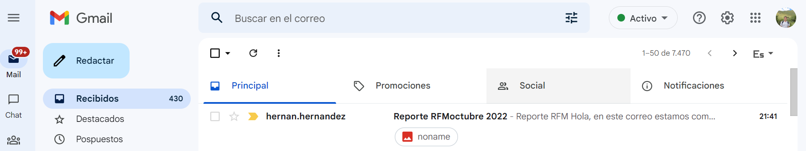

# Introducción ✋🏼

Sin dudas uno de los puntos más importantes en el mundo del análisis de datos es disponibilizar de forma oportuna y ágil nuestros reportes a los diversos stakeholder de la organización.

Existen diversas estrategias, como por ejemplo elaborar un dashboards. En esta ocasión voy a mostrar un ejemplo mediante el cuál podemos crear un correo electrónico ✉️ con nuestro reporte y enviarlo a los remitentes que nosotros deseemos.

Para ello utilizaremos la libreria 📚 **blastula** junto con **Rmarkdown.**

Estaremos compartiendo el **reporte RFM** que elaboramos en este [post](https://hghernandez.github.io/posts/2022-08-27-analisis-rfm-para-la-segmentacion-de-clientes/).

## Creamos el reporte 📰

Debemos crear un archivo Rmarkdown con formato de salida output: blastula::blastula_email

```{r eval= FALSE}

title: "RFM_report"
author: "Hernan Hernandez"
date: '2022-10-02'
output: blastula::blastula_email


```

# 💻 Creamos el script para enviar el correo electrónico

Para este paso usaremos la función **render_email** de blastula indicandole la ubicación de nuestro archivo .rmd

```{r eval=FALSE}

email <- render_email("C:/Users/usuario/Desktop/Reporte_RFM.Rmd")

```

## 📫 Configuramos el correo electrónico

```{r eval=FALSE}

email %>%
  smtp_send(to = "****",
            from = "****",
            subject = paste0("Reporte RFM",format(lubridate::ymd(Sys.Date()),"%B %Y")),
            credentials = creds_file(file = "gmail_creds"))

```

⚠️ Para poder usar blastula debemos tener contraseña de aplicación de gmail.

# 👀 Veamos el reporte

```{r  fig.cap = "Vista de la bandeja de entradas", out.width = "75%", fig.show = "hold", fig.align='center', echo=FALSE}


```

```{r  fig.cap = "Vista del cuerpo del email", out.width = "100%", fig.show = "hold", fig.align='center', echo=FALSE}
knitr::include_graphics("body_email2.PNG")

```

# Comentarios finales 🔈

✔️ Resulta muy interesante la funcionalidad que nos ofrece **blastula** permitiendo crear un correo electrónico con **nuestro reporte** directamente desde un archivo Rmarkdown.

✔️Además, aunque no lo abordamos en este ejemplo, admite la utilización de **parámetros** los que nos permitiría crear reportes que segmentan los datos y se envían a diferentes destinatarios. En este caso podríamos crear un reporte RFM por país y enviarlos a distintos destinatarios.

✔️ Sin dudas poder compartir un correo electrónico con nuestro reporte es una gran **estrategia de comunicación** de datos a los **stakeholder.**
